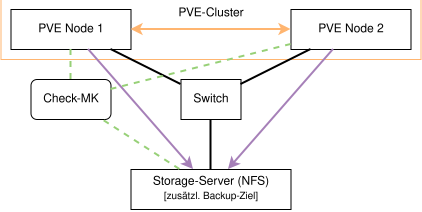

# LF10b-Projekt

## Projektbeschreibung

Ziel dieses Projekts ist die Einrichtung einer hochverfügbaren Virtualisierungsinfrastruktur auf Basis von Proxmox VE. Zwei Proxmox-Nodes bilden einen HA-Cluster, dessen virtuelle Maschinen und Container auf einem dedizierten Storage-Server (ZFS/NFS) liegen. Ein Quorum-Device sorgt dafür, dass der Cluster auch bei Ausfall eines Nodes entscheidungsfähig bleibt. Die Plattform wird zentral überwacht und automatisiert gesichert. Teile der Konfiguration werden mit Ansible automatisiert, die Installation des zweiten Proxmox-Nodes erfolgt mit dem Proxmox Automated Installer.

## Projektziele

* Kenntnisse zu Proxmox VE aufbauen
* Vertiefung der Kenntnisse von Virtualisierungsinfrastrukturen, insbesondere Cluster, HA und Quorum
* Vertiefung der praktischen Anwendung von Linux
* Vertiefung des Verständnis für Monitoring-Systeme und Backup-Strategien
* Erlernen von Automatisierungen mit Ansible und dem Proxmox Automated Installer
* Vorbereitung auf das Abschlussprojekt

## Welche Dienste sollen als Teil des Projektes integriert werden?

* Monitoring-System
* Backup-System
* Automatisierung der Einrichtung

### Umgebung

* Proxmox VE

## Erstellen Sie eine grobe Übersicht, wie die Architektur des Projekes aussehen sollen.

### Hardware
* 2 Server aus dem IT-Labor
* Switch
* Raspberry Pi (+ ext. HDD) - Backup, Storage und Quorum

### Betriebssysteme
* Debian als Basis von Proxmox VE und RaspberrypiOS

### Virtualisierung
* Proxmox VE

## Überlegen Sie für jeden Dienst, mit welcher Software er betrieben werden soll. Vergleichen Sie dafür alternative Softwarelösungen anhand geeigneter Kriterien.

* Virtualisierung - Proxmox VE
* Monitoring-System - CheckMK (LXC auf Proxmox)
* Backup-System - Proxmox vzdump auf NFS-Share
* Automatisierung - Ansible, in Proxmox integrierte Automatisierungen
* HA/Cluster - Proxmox HA + QDevice

### Vergleich von Monitoring-Lösungen

| Kriterium | CheckMK Raw | Zabbix | Prometheus + Grafana |
|---|---|---|---|
| **Einrichtungsaufwand** | Gering | Mittel | Hoch |
| **Auto-Discovery** | Ja | Begrenzt | Manuell |
| **Alerting** | Integriert | Integriert | Alertmanager separat |
| **RAM-Bedarf** | ~512 MB | ~1 GB | ~1,5 GB |

## Welche Recovery Time Objective (RTO) wollen Sie erreichen?
* Ausfall eines Nodes: HA startet die betroffenen VMs/Container automatisch auf dem verbleibenden Node neu (Ziel: wenige Minuten).
* Ausfall des Storage-Servers oder Totalausfall: Wiederherstellung innerhalb weniger Stunden anhand des Wiederanlaufplans, der Automatisierung und der Backups.

## Welche Systemeigenschaften sollen vom Monitoring überwacht werden?
* CPU-Nutzung
* RAM (verfügbarer RAM)
* Festspeicher (verfügbarer Speicher, Last)
* Netzwerk (genutzte Bandbreite, Latenz)
* Temperaturen
* Systemlast (Load)
* Uptime
* HA-Cluster: Cluster-Quorum, Status der HA-Ressourcen, NFS-Verfügbarkeit

## Automatisierung
* Automatisierung der Installation der Proxmox-Nodes mit der 
* Ansible: 
    * Enterprise-Repo deaktivieren, Community-Repo aktivieren
    * NFS-Backup-Storage einbinden
    * Backup-Job erstellen
    * CheckMK-Agent auf Nodes und Pi installieren

## Zeitplan
* Tag 1:
    * Netzwerk verkabeln, Proxmox auf-Node 1 installieren
    * Storage-Server einrichten: ZFS-Pool, NFS-Share und QDevice
    * Ansible einrichten (Inventory, SSH-Keys) und Playbooks für Repos und NFS-Storage ausführen
    * Proxmox-Node 2 mit dem Automated Installer installieren, Playbooks darauf anwenden
    * Cluster erstellen, QDevice einbinden, NFS als Shared Storage im Cluster hinzufügen
* Tag 2:
    * Test-VM auf dem Shared Storage anlegen, HA-Ressource konfigurieren
    * CheckMK-Container aufsetzen
    * CheckMK-Agent-Playbook schreiben und auf Nodes und Pi anwenden, Schwellwerte setzen
    * Backup-Job per Playbook einrichten
* Tag 3:
    * Backup- und Restoretest
    * HA-Test (Node ausschalten) und Quorum-Test (Node bzw. QDevice ausfallen lassen)
    * Alerts in CheckMK prüfen
    * Troubleshooting
    * Wiederanlaufplan finalisieren, Dokumentation

## Wer aus dem Team wird welche Aufgaben übernehmen?
* Alle Aufgaben - Ich

## Welche Anleitungen (bzw. Tutorials) soll genutzt werden? Welche sonstige Dokumentation könnte nützlich sein?
* Proxmox VE, Ansible, CheckMK und OpenZFS Dokumentation
* KI

---

# Wiederanlaufplan

## Systemübersicht

| Komponente | Funktion | Kritikalität |
|---|---|---|
| Proxmox-Node | Virtualisierungshost (VMs/CTs) | Hoch |
| CheckMK | Monitoring aller Systeme | Mittel |
| Storage-Server | Storage-Storage (NFS/ZFS) | Hoch |
| Switch | Netzwerkverbindung | Hoch |

## Notfallszenarien
### Ausfall einer VM/Container

### Ausfall eines Proxmox-Nodes

### Ausfall mehrerer Proxmox-Nodes

### Ausfall des Storage-Server

## Wiederanlaufpriorität

1. Netzwerk
2. Proxmox-Nodes
3. Storage-Server
4. CheckMK

## Vorbeugende Maßnahmen
* Tägliche Backups
* Monitoring
* Restoretests
* Dokumentation und Wiederanlaufplan
